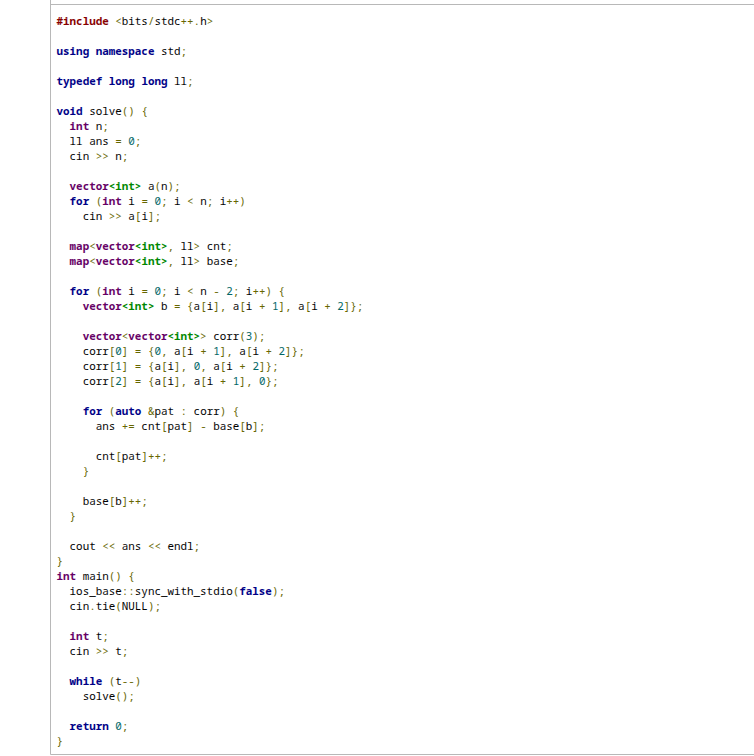

announce the list:
[Absolute Cinema](https://codeforces.com/contest/2195/problem/D)
[Two movies](https://codeforces.com/contest/1989/problem/C)
[Beautiful Triple Pairs](https://codeforces.com/contest/1974/problem/C)

# Absolute cinema
second order difference.
The key point is that the value of a1 and an.
We construct $g(x)=a_1 \cdot |1-x| + a_n \cdot |n-x|$
and then $g(n) = (n-1) \cdot a_1$. Same for $a_n$.

# Two movies
Greedy.
One point is that when the (0,0) or (0,-1), we can ignore this case, because we always choose 0.
And finally we allocate the (1,1) and (-1,-1).

# Beautiful Triple Pairs
We learn a new , beautiful way to select.
We construct the corresponds. 
