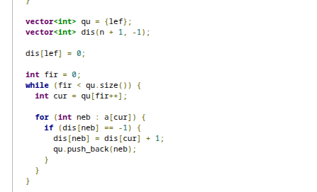
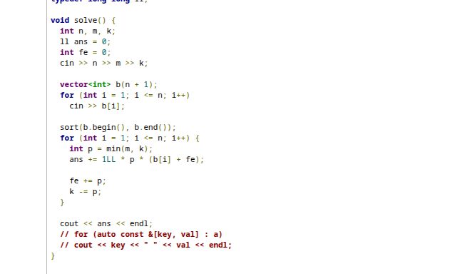

List:
[Game on tree](https://codeforces.com/contest/1970/problem/C1)
[Offshores](https://codeforces.com/contest/2194/problem/B)
[Lawn Mower](https://codeforces.com/contest/2194/problem/A)
[Parabola Independence](https://codeforces.com/contest/2195/problem/F)
[Ticket Hoarding](https://codeforces.com/contest/1951/problem/C)

# Game on tree
Thanks to t=1,  just a dfs problem. The condition used for checking the winner is easy: when there exists a even length, then Hermione win, otherwise Ron win.
What deserves to learn is code.
First we find one leave and begin with this. And dfs.

# Offshores

# Lawn Mower
Just a math poblem.

# Parabola Independence

# Ticket Hoarding
Greedy.
Actually, these exists a balance same as Offshores.
We can observe that no matter which one choose firstly , the cost always add 1. So we greedily begin with first element after sorting. By the way, notice the range of int, so we should use long long here.

