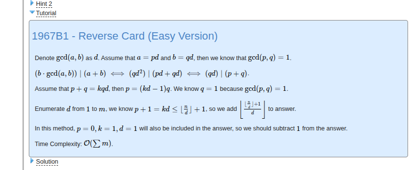

List:
[Missing Subsequence Sum](https://codeforces.com/contest/1965/problem/B)
[Reverse Card (Easy Version)](https://codeforces.com/contest/1967/problem/B1)

# Missing Subsequence Sum
Begin with the necessary of 1, so i write 2. And we can find that 1 2 4 can reach 7, and we add 8, so we just add the pow of  2.
So here we consider the biggest number satisfy $$2^i \le k$$, and construct $$a = [k - 2^i, k + 1, k + 1 + 2^i, 1, 2, 4, \dots, 2^{i-1}, 2^{i+1}, \dots, 2^{19}]$$.
There is only $$k+1+2^i$$ need to be test. Just try the biggest one we could reach after add $$k+1$$.

# Reverse Card (Easy Version)
Just a number theory problem. I don't want to say too much.
