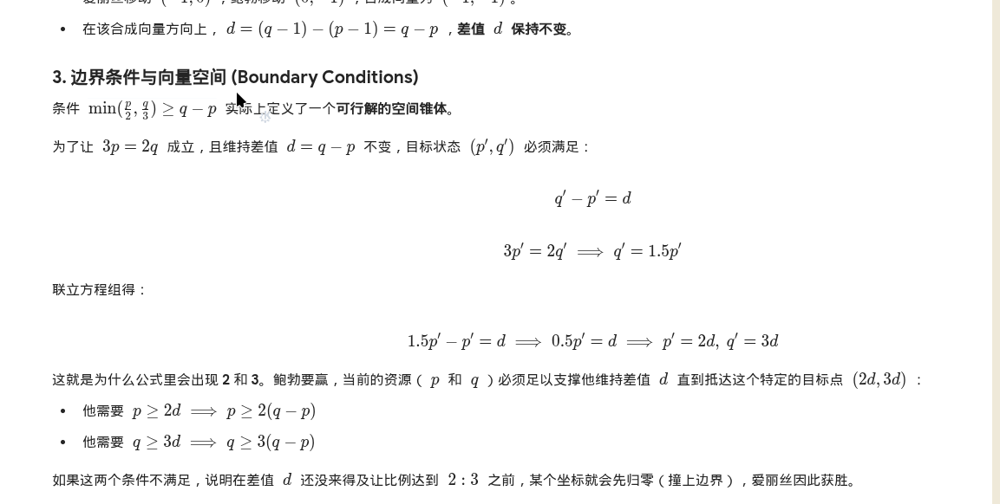

List:
[Game with a Fraction](https://codeforces.com/contest/2196/problem/A)

# Game with a Fraction
Obviously, this is a game.
The key point we solve a game is find a invariant. Here set $d = q - p$, we know that every time Alice add or minus 1, Bob can do the opposite operation to undo the change in the score.
When 
So we have condition 1: p<q. And condition 2 above.
