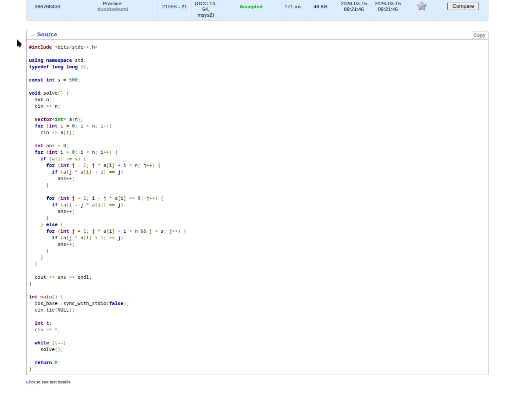

List:
[Another Problem about Beautiful Pairs](https://codeforces.com/contest/2196/problem/B)
[Restricted Sorting](https://codeforces.com/contest/2187/problem/A)

# Another Problem about Beautiful Pairs
This problem is so difficult. 
We use **Square Root Decomposition**.  To prevent the two loops, we divide the problem into two parts.
$j = i + k \cdot a_i$
If we just count by this equal, when $a_i$ is small, the time is O(n), and the complete time is going to be $O(n^2)$.
So we set $B = \sqrt{n}$.
Case 1: $a_i \ge B$
We just count the coordinate that satisfy the $$a_i \ge B$$. And at most we can check $$\frac{n}{\sqrt{n}} = \sqrt{n}$$ times.
Case 2: $a_i < B$ and $a_j < B$
Here we know that the case and there exits $a_i \cdot a_j = j - i$ and $a_i \cdot a_j = j - i$, so we have $j - i < B \cdot B = n$.
So we just count preview B position.

And totally is $O(n \sqrt{n})$.
We don't need to consider other cases, you can prove this.
And note that when the case 1 we also should check the answer before $a_i$.
The code is became easy.

# Restricted Sorting
Firstly i want to solve this by graph because this is totally can be viewed as a lian tong problem.
We just consider that if there exits two element can't be touched, what should we do.
Let's consider the limit. We get touched by the two max number and minimum number because this always point the longest distance.
So after sorting a get b, we have the condition:
$\min_{a_i \ne b_i}(\max(a_i-mn, mx-a_i))$.
