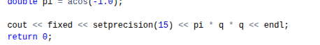
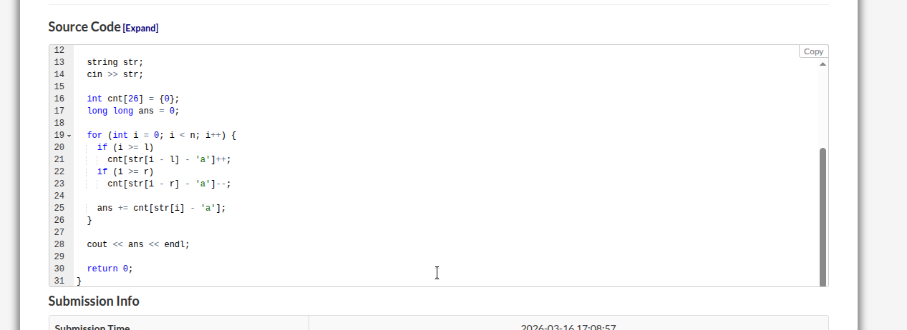

List:
[Parkour Design](https://codeforces.com/contest/2202/problem/A)
[Inaccurate Sub-sequence Search](https://codeforces.com/contest/1955/problem/D)
[π](https://atcoder.jp/contests/abc449/tasks/abc449_a)
[Comfortable Distance](https://atcoder.jp/contests/abc449/tasks/abc449_c)

# Parkour Design
我们考察三个位移方向的位移向量，可以知道v1+v2=2v3. 在线性代数上三者线性相关。
在此基础上我们可以得出两个条件。
首先根据线性规划，我们可以得出目标位置与斜率之间的关系
$-\frac{x}{4} \le y \le \frac{x}{2}$
对上述的结论，在线性相关的基础上，通过基变换，我们可以找到
$x+y \equiv 0 \pmod 3$

# Inaccurate Sub-sequence Search
这个题偏模拟。
我们使用滑动窗口配合哈希，针对加入与脱出做处理即可。

# π
acos(-1.0)具有很高的pi的精度。
对精度的刻画：

# Comfortable Distance
另一道很有意思的双指针。
这里代码先对r执行了r++，将双闭区间变成了半开半闭区间，这样后续处理双指针能完全包含最后面的那个元素。
